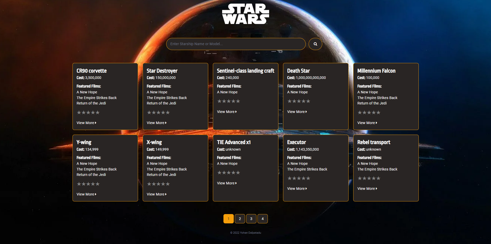

# StarWars Starships Portal

A Next.js app built with [The Star Wars API](https://swapi.dev/documentation).



## Contributing Code

If you would like to contribute features / refactor / etc., please open an Issue on this repo, and tag @yohandalpe - We can then open a new Pull Request if it is deemed in line with the projects goals.

Yet to complete:

* Modal
* User Rating

### Requirements

 * NodeJS

### Build Instructions

Set up environment:
```
npm install
```

Start server:
```
npm run dev
```

You may now access the app at URL: http://localhost:3000/

## Packages used
- [tailwindcss](https://tailwindcss.com/docs/installation)
- [@tailwindcss/forms](https://www.npmjs.com/package/@tailwindcss/forms)
- [font-awesome](https://www.npmjs.com/package/font-awesome)
- [react-paginate](https://www.npmjs.com/package/react-paginate)
- [react-rating-stars-component](https://www.npmjs.com/package/react-rating-stars-component)